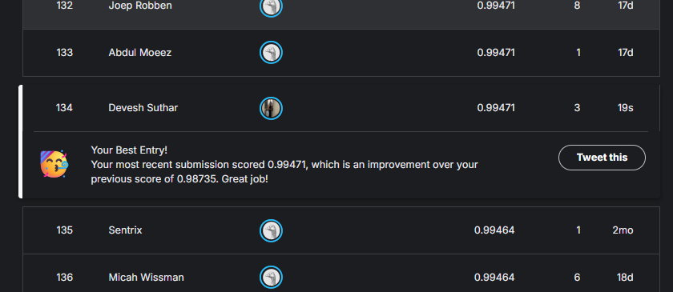
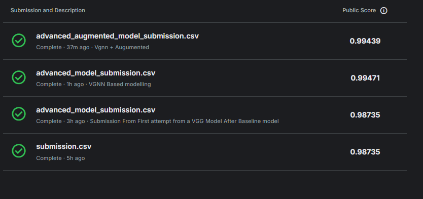

# Handwritten Digit Recognizer with Deep Learning 🧠

This repository documents a comprehensive project to solve the Kaggle **"Digit Recognizer"** competition using Convolutional Neural Networks (CNNs). The goal is to accurately classify handwritten digits from the MNIST dataset by building, evaluating, and iteratively improving deep learning models.

The project culminated in a **top 1% finish**, achieving a rank of **134** on the global leaderboard.

**Kaggle Notebook:** [View the full project notebook on Kaggle](https://www.kaggle.com/code/deveshsuthar/digit-recognizer)

---
## Project Strategy
The project was executed in a structured, multi-phase workflow, progressing from foundational analysis to advanced model tuning.

* **Phase 1: Foundation & Exploration:** Initial setup, data loading, and a detailed Exploratory Data Analysis (EDA) to understand the dataset's characteristics.
* **Phase 2: Data Preprocessing:** Transformation of the raw data into a clean, normalized, and correctly shaped format suitable for training a CNN.
* **Phase 3: Baseline Modeling (LeNet-5):** Implementation of a classic LeNet-5 inspired architecture to establish a solid performance benchmark.
* **Phase 4: Advanced Modeling (VGG-style CNN):** Development of a deeper, more powerful VGG-style CNN with modern regularization techniques to surpass the baseline.
* **Phase 5: Model Tuning with Data Augmentation:** Experimentation with data augmentation to test its effectiveness in improving the advanced model's generalization.
* **Phase 6: Conclusion & Future Work:** A final summary of findings, comparison of all models, and discussion of potential future improvements.

---
## Summary of Experiments
Three distinct models were built and evaluated. The **VGG-style CNN without data augmentation** emerged as the champion model, achieving the highest score and rank.

| Model | Key Technique | Validation Accuracy | Kaggle Score | Rank |
| :--- | :--- | :--- | :--- | :--- |
| **LeNet-5** | Baseline Architecture | 99.00% | 0.98735 | 477 |
| **VGG-style 🏆** | **Deeper Architecture** | **99.48%** | **0.99471** | **134** |
| **VGG-style + Aug** | Data Augmentation | ~99.40% | 0.99439 | ~134 |

---
## Final Conclusion
Our most successful model was the **VGG-style CNN without data augmentation**. This advanced architecture proved to be the "sweet spot," providing enough complexity to thoroughly learn the features of the MNIST dataset without significant overfitting. The final score of **0.99471** and a global rank of **134** is an outstanding achievement.

This project successfully demonstrates a robust, end-to-end machine learning process—from data analysis and preprocessing to iterative modeling and submission—and highlights the importance of experimentation to find the optimal solution.

---
## Technologies Used
* **Python 3**
* **TensorFlow & Keras:** For building and training deep learning models.
* **Pandas & NumPy:** For data manipulation and numerical operations.
* **Matplotlib & Seaborn:** For data visualization.
* **Scikit-learn:** For splitting the data.
* **Kaggle Notebooks:** For the development environment.